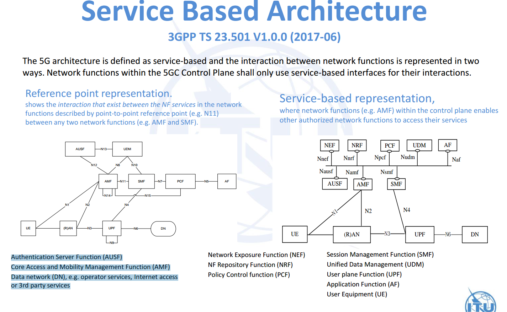
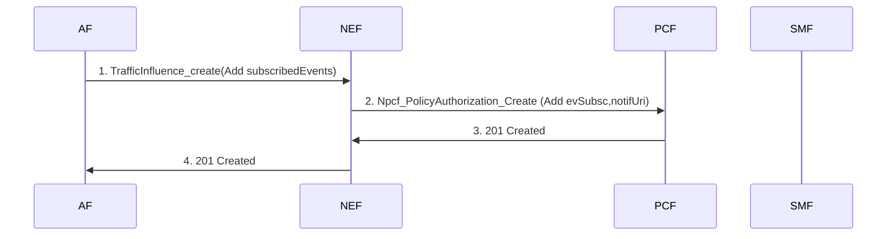

#NEF

## UC2
https://ericsson.sharepoint.com/:p:/r/sites/5GCNEF/Shared%20Documents/5GC%20NEF%20Study/NEF%20-%20Event%20Exposure.pptx?d=wb754bf4f67ce400583194ace6730dd61&csf=1&e=HVOi0J <https://ericsson.sharepoint.com/:p:/r/sites/5GCNEF/Shared%20Documents/5GC%20NEF%20Study/NEF%20-%20Event%20Exposure.pptx?d=wb754bf4f67ce400583194ace6730dd61&csf=1&e=HVOi0J> 

https://ericsson.sharepoint.com/:w:/r/sites/5GCNEF/Shared%20Documents/Test%20and%20CI/TA/UC2_EvEx/EventExposure_TA.docx?d=wc94162be6669434bbe2057f973e39e59&csf=1&e=X4tPLI <https://ericsson.sharepoint.com/:w:/r/sites/5GCNEF/Shared%20Documents/Test%20and%20CI/TA/UC2_EvEx/EventExposure_TA.docx?d=wc94162be6669434bbe2057f973e39e59&csf=1&e=X4tPLI> 

## Simulator

--http2-prior-knowledge

curl --http2-prior-knowledge http://localhost:80/test

## 5g works
NSSF: 
BSF:

curl  --http2-prior-knowledge --data @/home/elluffn/workspace/git/nef_ft/simulator/set_sim_profile.json  http://localhost:80/simulator/profile
curl --http2-prior-knowledge http://localhost:80/nnrf-disc/v1/nf-instances?target-nf-type="BSF"\&requester-nf-type="NEF"\&service-names="nbsf-management"
curl --http2-prior-knowledge http://localhost:80/nnrf-nfm/v1/nf-instances/AE93721B-8901-3456-1234-123456789ABC
curl  --http2-prior-knowledge  http://localhost:80/simulator/profile

curl  --http2-prior-knowledge --data @/opt/nef/simulator/set_sim_profile.json  http://nrf-simulator-service:80/simulator/profile
curl --http2-prior-knowledge http://nrf-simulator-service:80/nnrf-disc/v1/nf-instances?target-nf-type="BSF"\&requester-nf-type="NEF"\&service-names="nbsf-management"
curl --http2-prior-knowledge http://nrf-simulator-service:80/nnrf-nfm/v1/nf-instances/AE93721B-8901-3456-1234-123456789ABC
curl  --http2-prior-knowledge  http://nrf-simulator-service:80/simulator/profile

helm install chart/nef-simulator/ --set devHostPath=/home/elluffn/workspace/git/nef_ft

helm install ../nef/charts/nef-nbi/ --set nefconfig.udrUrl=http://udr-simulator-service:80 --set nefconfig.nrfUrl=http://nrf-simulator-service:80

curl  --http2-prior-knowledge http://testrunner-service:80/nbsf-management/v1/pcfBindings?ipv4Addr="10.10.10.1"

curl --http2-prior-knowledge  -H'content-type:application/json' --data '{"configuredLevel": "DEBUG"}'  http://nef-nbi-service:5080/actuator/loggers/ROOT

helm install charts/nef-nbi/ --set nefconfig.udrUrl=http://udr-simulator-service:80 --set nefconfig.nrfUrl=http://nrf-simulator-service:80 --set nefconfig.nefNotifyUrl=http://nef-nbi-service:5080 --set nbi.logging.adp=False --set image.tag=0.0.1-release -n nef

helm install charts/nef-nbi/ --set nefconfig.udrUrl=http://udr-simulator-service:80 --set nefconfig.nrfUrl=http://nrf-simulator-service:80 --set nefconfig.nefNotifyUrl=http://nef-nbi-service:5080 --set nbi.logging.adp=False -n nef

## cleanup DB
}

 

"3gpp-traffic-influence/v1/{afId}/subscriptions/cleandb"

 

@RequestMapping(value = "/cleandb", method = RequestMethod.POST, produces = { "application/json" })
Mono<ResponseEntity<?>> internalCleanDB()  {
    SessionDBImpl sessionDB = SessionDBImpl.getInstance();
    sessionDB.cleanDB();
    return Mono.just(ResponseEntity.ok( "deleted" ));
}

 

 

Session Management Function (SMF)
Unified Data Management (UDM)
User plane Function (UPF)
Application Function (AF)
User Equipment (UE)

Network Exposure Function (NEF)
NF Repository Function (NRF)
Policy Control function (PCF)

Authentication Server Function (AUSF)
Core Access and Mobility Management Function (AMF)
Data network (DN), e.g. operator services, Internet access
or 3rd party services

## NEF communication

* inbound
    - NRF

* outbound

## Git
git clone https://elluffn@gerrit.ericsson.se/a/nef/nef.git

## ENV
VM:

seliius06393

seliius06394

seliius06395

seliius06396

Seliius06397

 

 

K8S:

Eccd-udm00014

 

Dashboard   https://dashboard.eccd-udm00014.seli.gic.ericsson.se(admin/ericsson)

 

Kubectl: http://admin-config-fileserver.eccd-udm00014.seli.gic.ericsson.se/download/kubectl

 

Admin.conf:  http://admin-config-fileserver.eccd-udm00014.seli.gic.ericsson.se/download/admin.conf

## Account 
UDM GIC Env is using be develop NEF, which is total different with ADP Env
 
Following link is help us to access GIC Env.
 
https://confluence.lmera.ericsson.se/display/GLPUT/How+to+access+GIC

## 5G AMF UPF SMF PCF UDM DN AUSF AF functions | 5G NR Network Nodes

 This page describes 5G NR Network Nodes functions. It covers 5G NR nodes or modules AMF, UPF, SMF, PCF, UDM, DN, AUSF and AF.

Introduction:
The 5G stands for 5th generation of wireless technology. It follows 3GPP road map from which LTE i.e. 4th generation wireless technology and LTE advanced have been developed.
5G NR Reference Point Architecture

• The figure-1 depicts 5G reference point architecture as specified in 3GPP TS 38.300 and 3GPP TS 23.501 specifications. This is non-roaming 5G architecture. The figure shows NG1 to NG15 reference points or interfaces used in the 5G NR reference point architecture.
• gNB node providing NR user plane and control plane protocol terminations towards the UE, and connected via the NG interface to the 5GC.
• ng-eNB node providing E-UTRA user plane and control plane protocol terminations towards the UE and connected via the NG interface to the 5GC.
Refer 5G basic tutorial >>.

Let us understand functions of each of the nodes shown in the figure.
5G NR AMF Functions

AMF stands for Access and Mobility Management Function. Following are the functions of 5G NR AMF node.
• Termination of RAN CP interface (N2)
• Termination of NAS (N1), NAS ciphering and integrity protection.
• Registration management.
• Connection management.
• Reachability management.
• Mobility Management.
• Lawful intercept (for AMF events and interface to LI System).
• Provide transport for SM messages between UE and SMF.
• Transparent proxy for routing SM messages.
• Access Authentication and Access Authorization
• Provide transport for SMS messages between UE and SMSF.
• Security Anchor Functionality (SEAF). It interacts with the AUSF and the UE, receives the intermediate key that was established as a result of the UE authentication process. In the case of USIM based authentication, the AMF retrieves the security material from the AUSF.
• Security Context Management (SCM). The SCM receives a key from the SEAF that it uses to derive access-network specific keys.
• Location Services management for regulatory services.
• Provide transport for Location Services messages between UE and LMF as well as between RAN and LMF.
• EPS Bearer ID allocation for interworking with EPS.
• UE mobility event notification.

In addition to the above mentioned functions, AMF also support functionalities for non 3GPP access networks.
5G NR UPF Functions

UPF stands for User plane function. Following are the functions of 5G NR UPF node.
• Anchor point for Intra-/Inter-RAT mobility (when applicable).
• External PDU Session point of interconnect to Data Network.
• Packet routing & forwarding
• Packet inspection
• User Plane part of policy rule enforcement, e.g. Gating, Redirection, Traffic steering.
• Lawful intercept (UP collection).
• Traffic usage reporting.
• QoS handling for user plane, e.g. UL/DL rate enforcement, Reflective QoS marking in DL.
• Uplink Traffic verification (SDF to QoS Flow mapping).
• Transport level packet marking in the uplink and downlink.
• Downlink packet buffering and downlink data notification triggering.
• Sending and forwarding of one or more "end marker" to the source NG-RAN node.
5G NR SMF Functions

SMF stands for Session Management Function. Following are the functions of 5G NR SMF node.
• Session Management;
• UE IP address allocation and management;
• Selection and control of UP function;
• Configures traffic steering at UPF to route traffic to proper destination;
• Control part of policy enforcement and QoS;
• Downlink Data Notification.
5G NR PCF Functions

PCF stands for Policy Control Function. Following are the functions of 5G NR PCF node.
• Supports unified policy framework to govern network behaviour.
• Provides policy rules to Control Plane function(s) to enforce them.
• Accesses subscription information relevant for policy decisions in a Unified Data Repository (UDR).
5G NR UDM Functions

UDM stands for Unified Data Management. Following are the functions of 5G NR UDM node.
• Generation of 3GPP AKA Authentication Credentials.
• User Identification Handling
• Access authorization based on subscription data (e.g. roaming restrictions).
• UE's Serving NF Registration Management
• Support to service/session continuity e.g. by keeping SMF/DNN assignment of ongoing sessions.
• MT-SMS delivery support.
• Lawful Intercept Functionality
• Subscription management.
• SMS management.
5G NR DN Functions

DN stands for Data Network. Following are the functions of 5G NR DN node.
•  Operator services, Internet access or other services
5G NR AUSF Functions

Following are the functions of 5G NR AUSF node.
• Supports Authentication Server Function (AUSF) as specified by SA WG3.
5G NR AF Functions

AF stands for Application Function. Following are the functions of 5G NR AF node.
• Application influence on traffic routing
• Accessing Network Exposure Function
• Interacting with the Policy framework for policy control 

##	NEF Services
The following NF services are specified for NEF:
- Table 7.2.8-1: NF Services provided by NEF

| Service Name	| Description	| Reference in TS 23.502 [3] |
|---------------| --------------|----------------------------|
|Nnef_EventExposure	|Provides support for event exposure	|5.2.6.2|
|Nnef_PFDManagement	|Provides support for PFDs management	|5.2.6.3|
|Nnef_ParameterProvision	|Provides support to provision information which can be used for the UE in 5GS	|5.2.6.4|
|Nnef_Trigger	|Provides support for device triggering	|5.2.6.5|
|Nnef_BDTPNegotiation	|Provides support for negotiation about the transfer policies for the future background data transfer	|5.2.6.6|
|Nnef_ TrafficInfluence	|Provide the ability to influence traffic routing.	|5.2.6.7.2|

## MUC1 with UP event subscription

#### Npcf_PolicyAuthorization_Create
The AF may also include the "evSubsc" attribute of "EventSubscReqData" data type to request the notification of certain user plane events. The AF shall include the events to subscribe to in the "events" attribute, and the notification URI where to address the Npcf_PolicyAuthorization_Notify service operation in the "notifUri" attribute. The events subscription is provisioned in the "Events Subscription" sub-resource.

5.4.3.3.6	Type: EventNotification
Table 5.4.3.3.6-1: Definition of type EventNotification

|Attribute name |	Data type|	P	|Cardinality	|Description	|Applicability|
|--|--|--|--|--|--|
|afTransId	|string	|O	|0..1	|Identifies an NEF Northbound interface transaction, generated by the AF.	||
|activityStatus	|boolean	|O|	0..1	|Identifies whether the AF request is active or inactive.Shall be present if the "subscribedEvent" sets to "ACTIVITY".||	
|notifyType	|NotifyType	|M	|1	|Identifies the type of notification regarding UP patch management event.	||
|sourceTrafficRoute	|TrafficRoute	|O	|0..1|	Identifies the N6 traffic routing information associated to the source DNAI.Shall be present if the "subscribedEvent" sets to "CHANGE_OF_DNAI".||	
|subscribedEvent	|SubscribedEvent	|M|	1|	Identifies a UP path management event the AF requested to be notified of.	||
|targetTrafficRoute	|TrafficRoute	|O|	0..1|	Identifies the N6 traffic routing information associated to the target DNAI.Shall be present if the "subscribedEvent" sets to "CHANGE_OF_DNAI".||	
**Note from 29.514   chapter 4.2.2.8** :
The AF may also subscribe to notifications about UP path management events. The AF shall include in the "events" attribute an entry of the "AfEventSubscription" data type to subscribe to:
-	notifications of early and/or late DNAI change, using the "DNAI_CHG" value of data type "AfEvent", and the attribute "dnaiChgType" indicating whether the subscription is for "EARLY", "LATE" or "EARLY_LATE";
-	notification of the activation/deactivation of the applicability of traffic routing requirements, using the "ROUT_REQ_STATUS_CHG" value of data type "AfEvent".
NOTE 2:	The activation/deactivation of the applicability of traffic routing requirements is determined by the temporal validity and validity areas included in the "AfRoutingRequirement" data type.
## REF
[0] 5GC Support for Edge Computing Solution description, BDGS-18:001001 Uen, Rev A
[1] 3GPP 23.501, vf10->f20, System Architecture for the 5G System
[2] 3GPP 23.502, vf10->f20, Procedures for the 5G System
[3] 3GPP 29.522, v0.3.0 ->1.0.0, Network Exposure Function Northbound APIs 
[4] 3GPP 29.510, v0.6.0->0.7->1.0.0, Network Function Repository Services
[5] 3GPP 29.521, v0.4.0->1.0.0, Binding Support Management Service
[6] 3GPP 29.512, v0.5.0 Session Management Policy Control Service
[7] 3GPP 29.514, v0.5.0->1.0.0, Policy Authorization Service
[8] 3GPP 29.504, v0.3.0->1.0.0, Unified Data Repository Services
[9] 3GPP 29.519, v0.3.0->1.0.0, Usage of the Unified Data Repository service for Policy Control Data, Application Data and Structured Data for Exposure
[10] 3GPP 29.122, v1.2.0, T8 reference point for Northbound APIs
[11] 3GPP 29.508, v0.6.0->f.0.0, Session Management Event Exposure Service;
